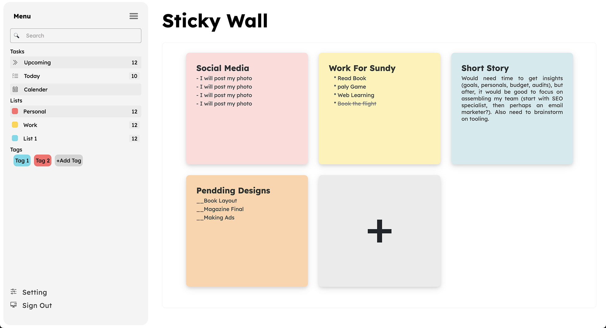

# Sticky Wall Web Project

Welcome to the Sticky Wall Web project! This project was created as a learning endeavor to explore web development. The current version provides a basic sticky wall interface with a sidebar containing categories and menus, as well as a main panel for displaying sticky notes.

## Project Structure

The project is structured as follows:

- `index.html`: The main HTML file that serves as the entry point for the web application.
- `styles.css`: The CSS file containing styles for the project.
- `script.js`: Currently empty JavaScript file where future functionalities will be implemented.
- `images/`: A directory to store any images used in the project.

## Screenshots



## Features

- **Sticky Wall Interface**: The main panel displays a sticky wall where sticky notes can be added in future iterations.
- **Sidebar**: The sidebar contains categories and menus for organizing sticky notes, though it is currently static and non-functional.

## Future Plans

The project is in its early stages, and future plans include:

- **Functionality**: Implementing the ability to add, edit, and delete sticky notes.
- **Responsiveness**: Making the web application responsive to ensure a seamless experience across various devices.
- **Dynamic Sidebar**: Enabling dynamic interactions within the sidebar, allowing users to organize and categorize their sticky notes efficiently.

## Getting Started

1. Clone the repository to your local machine:

   ```bash
   git clone https://github.com/sameermuslim/sticky-wall.git
   ```
